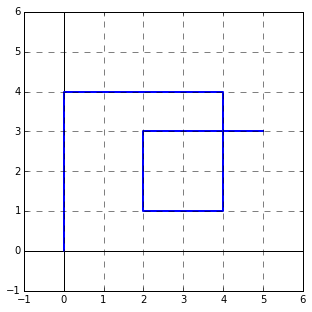

# RobotWalk
https://www.codewars.com/kata/58a64b48586e9828df000109/train/csharp

Simple Fun #130: Robot Walk

Task
A robot is standing at the (0, 0) point of the Cartesian plane and is oriented towards the vertical (y) axis in the direction of increasing y values (in other words, he's facing up, or north). The robot executes several commands each of which is a single positive integer. When the robot is given a positive integer K it moves K squares forward and then turns 90 degrees clockwise.

The commands are such that both of the robot's coordinates stay non-negative.

Your task is to determine if there is a square that the robot visits at least twice after executing all the commands.

Example
For a = [4, 4, 3, 2, 2, 3], the output should be true.

The path of the robot looks like this:

The point (4, 3) is visited twice, so the answer is true.

Input/Output
[input] integer array a
An array of positive integers, each number representing a command.

Constraints:

3 ≤ a.length ≤ 100

1 ≤ a[i] ≤ 10000

[output] a boolean value
true if there is a square that the robot visits at least twice, false otherwise.

